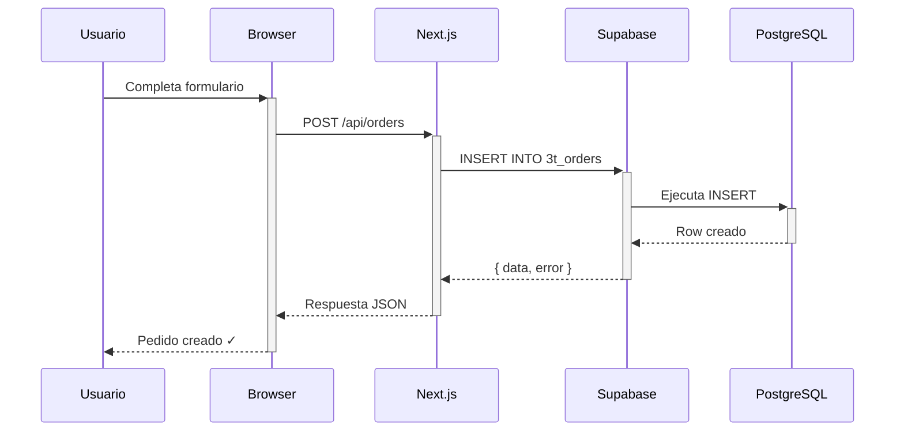
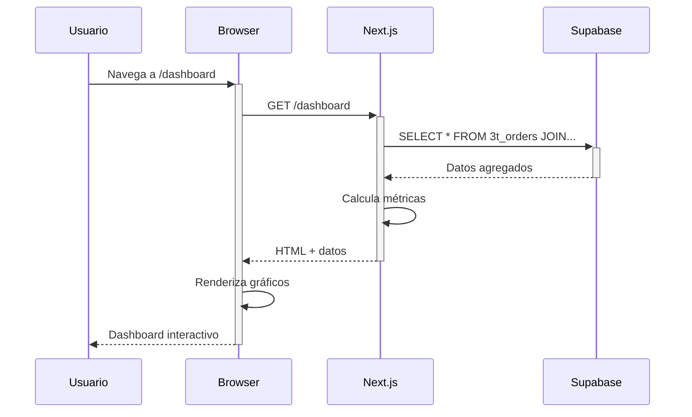

# 🏗️ Arquitectura Técnica - Agua Tres Torres

Documento técnico detallado de la arquitectura, decisiones de diseño y configuraciones del sistema.

---

## 📐 Arquitectura de Contenedores

### Configuración Docker

#### Dockerfile Multi-Stage

El proyecto usa un **Dockerfile multi-stage** para optimizar el tamaño de la imagen:

```dockerfile
# Stage 1: Base - Node 20 Alpine
FROM node:20-alpine AS base

# Stage 2: Deps - Instalar dependencias
FROM base AS deps
RUN apk add --no-cache libc6-compat
WORKDIR /app
COPY package.json package-lock.json* ./
RUN npm ci

# Stage 3: Builder - Build de Next.js
FROM base AS builder
WORKDIR /app
COPY --from=deps /app/node_modules ./node_modules
COPY . .
ARG NEXT_PUBLIC_SUPABASE_URL
ARG NEXT_PUBLIC_SUPABASE_ANON_KEY
ENV NEXT_PUBLIC_SUPABASE_URL=$NEXT_PUBLIC_SUPABASE_URL
ENV NEXT_PUBLIC_SUPABASE_ANON_KEY=$NEXT_PUBLIC_SUPABASE_ANON_KEY
ENV NEXT_TELEMETRY_DISABLED=1
RUN npm run build

# Stage 4: Runner - Imagen de producción (final)
FROM base AS runner
WORKDIR /app
ENV NODE_ENV=production
ENV NEXT_TELEMETRY_DISABLED=1

RUN addgroup --system --gid 1001 nodejs
RUN adduser --system --uid 1001 nextjs

COPY --from=builder /app/public ./public
RUN mkdir .next
RUN chown nextjs:nodejs .next

COPY --from=builder --chown=nextjs:nodejs /app/.next/standalone ./
COPY --from=builder --chown=nextjs:nodejs /app/.next/static ./.next/static

USER nextjs

EXPOSE 3002
ENV PORT=3002
ENV HOSTNAME="0.0.0.0"

CMD ["node", "server.js"]
```

**Ventajas**:
- ✅ Imagen final liviana (~150MB vs ~1GB)
- ✅ Solo incluye archivos necesarios para producción
- ✅ Capa de caché eficiente
- ✅ Seguridad mejorada (usuario no-root)

#### Docker Compose

```yaml
services:
  3t-app:
    build:
      context: .
      dockerfile: Dockerfile
      args:
        - NEXT_PUBLIC_SUPABASE_URL=https://api.loopia.cl
        - NEXT_PUBLIC_SUPABASE_ANON_KEY=eyJhbGci...
    container_name: 3t-app
    expose:
      - "3002"  # Puerto interno, no expuesto al host
    environment:
      - NODE_ENV=production
      - NEXT_PUBLIC_SUPABASE_URL=https://api.loopia.cl
      - NEXT_PUBLIC_SUPABASE_ANON_KEY=eyJhbGci...
    networks:
      - cane_net  # Red interna compartida
    restart: unless-stopped
    volumes:
      - ./public:/app/public:ro  # Solo lectura
    healthcheck:
      test: ["CMD", "wget", "--no-verbose", "--tries=1", "--spider", "http://localhost:3002/"]
      interval: 30s
      timeout: 10s
      retries: 3
      start_period: 40s

networks:
  cane_net:
    external: true  # Red creada externamente
```

**Decisiones clave**:
- **`expose` vs `ports`**: Usamos `expose` para que el puerto **solo sea accesible dentro de la red Docker**, no desde el host.
- **Red externa**: `cane_net` es compartida con otros servicios (Supabase, Nginx Proxy Manager).
- **Healthcheck**: Verifica que Next.js esté respondiendo antes de marcar el contenedor como "healthy".
- **Restart policy**: `unless-stopped` asegura que el contenedor se reinicie automáticamente tras errores o reboot del servidor.

---

## 🌐 Networking

### Esquema de Red

```
┌─────────────────────────────────────────────────┐
│              Internet (HTTPS)                    │
└────────────────────┬────────────────────────────┘
                     │
                     │ Puerto 443 (HTTPS)
                     │
          ┌──────────▼──────────┐
          │  Nginx Proxy Mgr    │
          │  Container          │
          │  (openresty)        │
          └──────────┬──────────┘
                     │
                     │ cane_net (red interna)
                     │
          ┌──────────▼──────────┐
          │   3t-app            │
          │   Puerto: 3002      │
          │   IP: dinámica      │
          └──────────┬──────────┘
                     │
                     │ HTTPS
                     │
          ┌──────────▼──────────┐
          │   Supabase          │
          │   api.loopia.cl     │
          └─────────────────────┘
```

### Resolución DNS Interna

Dentro de la red `cane_net`, los contenedores se pueden comunicar por **nombre**:

```bash
# Nginx Proxy Manager puede hacer:
proxy_pass http://3t-app:3002;

# 3t-app puede hacer:
curl https://api.loopia.cl/rest/v1/3t_customers
```

Docker mantiene un **DNS interno** que resuelve nombres de contenedores a sus IPs dinámicas.

---

## 🔐 Seguridad

### Buenas Prácticas Implementadas

#### 1. Usuario No-Root
```dockerfile
RUN adduser --system --uid 1001 nextjs
USER nextjs
```
El proceso de Next.js corre con usuario `nextjs` (UID 1001), no con root.

#### 2. Puerto No Expuesto
```yaml
expose:
  - "3002"  # Solo interno, no accesible desde host
```
El puerto **no está mapeado al host**, solo accesible dentro de `cane_net`.

#### 3. Variables de Entorno
Las credenciales están en `docker-compose.yml`, **no hardcodeadas** en el código.

#### 4. SSL/TLS
Todo el tráfico externo usa **HTTPS** gracias a Nginx Proxy Manager con Let's Encrypt.

#### 5. Read-Only Volumes
```yaml
volumes:
  - ./public:/app/public:ro  # Solo lectura
```

#### 6. Healthcheck
Detecta si el contenedor está "zombie" (corriendo pero sin responder).

---

## 📊 Flujo de Datos

### Creación de un Pedido



### Renderizado de Dashboard



---

## 🗄️ Modelo de Datos

### Relaciones

```
┌─────────────────┐
│  3t_customers   │
│  (PK: id)       │
└────────┬────────┘
         │ 1
         │
         │ N
┌────────▼────────┐         ┌─────────────────┐
│  3t_addresses   │         │  3t_orders      │
│  (FK: customer) │◄────────┤  (FK: customer) │
└─────────────────┘    N    │  (FK: address)  │
                        1    │  (FK: product)  │
                             └────────┬────────┘
                                      │ N
                                      │
                                      │ 1
                             ┌────────▼────────┐
                             │  3t_products    │
                             │  (PK: id)       │
                             └─────────────────┘
```

### Queries Complejas

#### Pedidos con Datos Completos
```typescript
const { data } = await supabase
  .from('3t_orders')
  .select(`
    *,
    customer:3t_customers!customer_id (
      id,
      name,
      customer_type,
      phone
    ),
    address:3t_addresses!address_id (
      id,
      street,
      city,
      latitude,
      longitude
    ),
    product:3t_products!product_id (
      id,
      format,
      base_price
    )
  `)
  .order('created_at', { ascending: false });
```

#### Agregaciones para Dashboard
```typescript
// Total de ventas por tipo de cliente
const { data } = await supabase
  .from('3t_orders')
  .select('total_price, customer:3t_customers(customer_type)')
  .gte('order_date', startDate)
  .lte('order_date', endDate);

// Agrupar en el cliente
const ventasHogar = data
  .filter(o => o.customer?.customer_type === 'hogar')
  .reduce((sum, o) => sum + (o.total_price || 0), 0);
```

---

## ⚡ Optimizaciones

### 1. Next.js Standalone Output
```typescript
// next.config.ts
const nextConfig: NextConfig = {
  output: 'standalone',  // Optimiza para Docker
};
```
Esto genera un bundle mínimo en `.next/standalone/` con solo lo necesario.

### 2. Static Generation
Páginas como `/` y `/mapa` se pre-renderizan en build time:
```
○  (Static)  prerendered as static content
```

### 3. Turbopack
Usamos Turbopack (sucesor de Webpack) para builds más rápidos:
```bash
npm run build -- --turbopack
```

### 4. Image Optimization
Next.js optimiza imágenes automáticamente (aunque este proyecto no usa muchas imágenes).

### 5. Code Splitting
Next.js divide el código en chunks pequeños:
```
chunks/06558a999f9bac30.js   20.6 kB
chunks/30cb146bc1e6f45f.js   59.2 kB
...
```

---

## 🔄 CI/CD (Futuro)

### Propuesta de Pipeline

```yaml
# .github/workflows/deploy.yml
name: Deploy to Production

on:
  push:
    branches: [main]

jobs:
  deploy:
    runs-on: ubuntu-latest
    steps:
      - uses: actions/checkout@v3
      
      - name: Build Docker Image
        run: docker compose build
      
      - name: Push to Registry
        run: docker push ...
      
      - name: Deploy to Server
        uses: appleboy/ssh-action@v0.1.5
        with:
          host: ${{ secrets.SERVER_HOST }}
          script: |
            cd /opt/cane/3t
            docker compose pull
            docker compose up -d
```

---

## 📈 Monitoreo (Futuro)

### Herramientas Recomendadas

1. **Uptime Kuma** (ya disponible en el proyecto Cane)
   - Monitoreo de disponibilidad
   - Alertas por Telegram/Email

2. **Prometheus + Grafana**
   - Métricas de rendimiento
   - Uso de CPU/RAM del contenedor

3. **Loki**
   - Agregación de logs
   - Búsqueda centralizada

---

## 🧪 Testing (Futuro)

### Stack Propuesto

```bash
# Unit tests
npm install -D vitest @testing-library/react

# E2E tests
npm install -D playwright

# Coverage
npm run test:coverage
```

---

## 🔧 Configuración Next.js

### next.config.ts

```typescript
import type { NextConfig } from "next";

const nextConfig: NextConfig = {
  output: 'standalone',  // Para Docker
  
  // Supabase no requiere config de imágenes externa
  
  // Experimental features
  experimental: {
    // typedRoutes: true,  // Rutas tipadas
  },
};

export default nextConfig;
```

### tailwind.config.ts

```typescript
import type { Config } from "tailwindcss";

const config: Config = {
  darkMode: ["class"],  // Soporte para tema oscuro
  content: [
    "./pages/**/*.{ts,tsx}",
    "./components/**/*.{ts,tsx}",
    "./app/**/*.{ts,tsx}",
    "./src/**/*.{ts,tsx}",
  ],
  theme: {
    extend: {
      // Colores personalizados de shadcn/ui
    },
  },
  plugins: [require("tailwindcss-animate")],
};

export default config;
```

---

## 📝 Convenciones de Código

### Estructura de Componentes

```tsx
// Imports
import { useState, useEffect } from 'react';
import { supabase } from '@/lib/supabase';

// Types
interface Props {
  // ...
}

// Component
export default function Component({ props }: Props) {
  // States
  const [data, setData] = useState<Type[]>([]);
  
  // Effects
  useEffect(() => {
    loadData();
  }, []);
  
  // Functions
  async function loadData() {
    // ...
  }
  
  // Render
  return (
    <div>
      {/* ... */}
    </div>
  );
}
```

### Naming Conventions

- **Archivos**: `kebab-case.tsx`
- **Componentes**: `PascalCase`
- **Funciones**: `camelCase`
- **Constantes**: `UPPER_SNAKE_CASE`
- **Tipos**: `PascalCase`

---

## 🛠️ Herramientas de Desarrollo

```bash
# Linter
npm run lint

# Type check
npm run build

# Dev server
npm run dev

# Production build
npm run build
npm start
```

---

## 📚 Referencias

- [Next.js Docs](https://nextjs.org/docs)
- [Supabase Docs](https://supabase.com/docs)
- [shadcn/ui](https://ui.shadcn.com/)
- [Docker Best Practices](https://docs.docker.com/develop/dev-best-practices/)
- [Nginx Proxy Manager](https://nginxproxymanager.com/)

---

**Última actualización**: Octubre 2025

